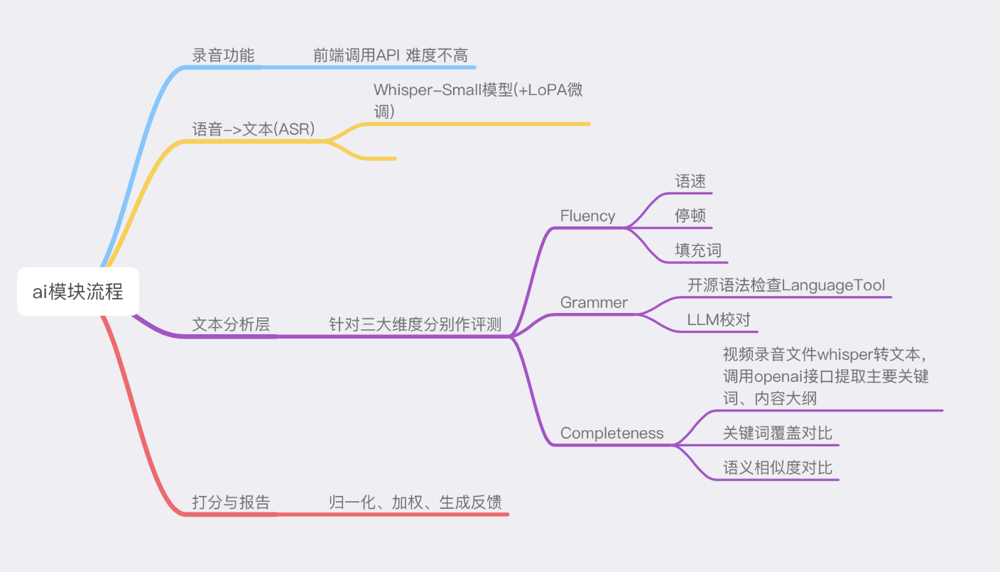
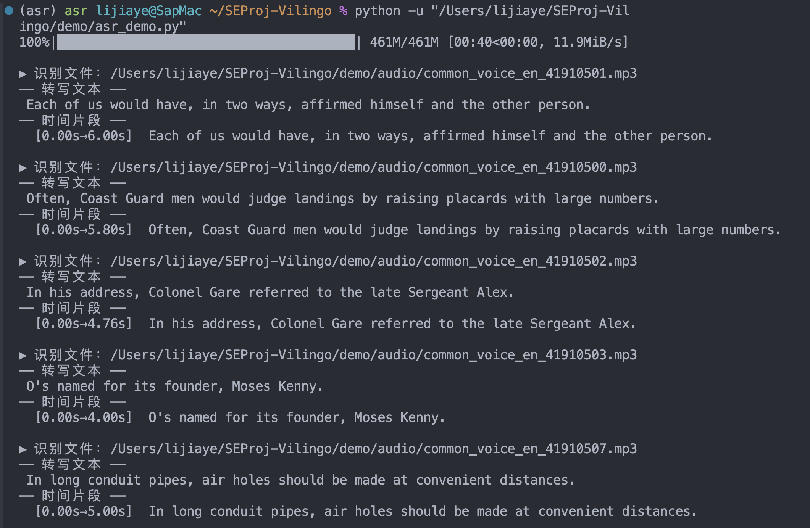

#  SEProject2025-Vilingo-AI

> 这是软件工程实践2025课程，项目Vilingo的AI板块，主要负责Vilingo项目中的语音识别与打分部分中的ai模块，详细的功能流程如下所示：

 * 用户录音打分板块

   * 正确接受前端发送过来的用户录音

   * 使用whisper-small模型对录音文件进行转文本操作，获取到：

     * transcript:完整转写文本
     * Segments:每段话的开始/结束时间（时间戳列表）

   * 针对三大维度进行分析：

     * Fluency：

       * 语速
       * 停顿
       * 填充词

     * Grammer：

       * 开源语法检查LanguageTool
       * LLM校对

     * Completeness：

       * 关键词覆盖对比
       * 语义相似度对比

     * 打分与报告：

       归一化、加权、生成反馈




##  环境配置

具体的环境安装包已经写入文件`reqirements.txt`中，配置环境的时候只需要：（推荐使用conda）

```bash
conda create -n asr python=3.9 -y
conda activate asr
pip install --upgrade pip
pip install -r requirements.txt
```


在安装系统依赖的时候，

* MacOS

```bash
brew install ffmpeg git
```


* Windows

1. 下载并解压FFmpeg静态包（https://www.gyan.dev/ffmpeg/builds/）
2. 解压后的bin目录添加到系统的环境变量PATH中。


#  工作流分析

在本项目中，我们需要完成


##  Whisper模型

**whisper模型 **识别音频文件的时候会输出与评分标准相关的以下关键词：

| Whisper 字段                | 数据类型    | 字段含义                                            | 可用于的评分维度                     |
| --------------------------- | ----------- | --------------------------------------------------- | ------------------------------------ |
| `text`                      | `str`       | 完整转写文本（所有片段拼接）                        | Completeness / Grammar / Word Choice |
| `segments[].text`           | `str`       | 单句（片段）转写文本                                | Completeness / Fluency / Grammar     |
| `segments[].start`          | `float`     | 片段起始时间（秒）                                  | Fluency（停顿间隔分析）              |
| `segments[].end`            | `float`     | 片段结束时间（秒）                                  | Fluency（停顿间隔分析）              |
| `segments[].avg_logprob`    | `float`     | 模型对该片段文本的平均对数概率，越接近 0 置信度越高 | Fluency / Pronunciation Confidence   |
| `segments[].no_speech_prob` | `float`     | 片段为静音的概率（0–1）                             | Completeness（跳句 / 静默检测）      |
| `segments[].tokens`         | `List[int]` | 文本对应的 token ID 序列                            | 可选：Grammar / 词序分析             |
| `language`                  | `str`       | 自动检测语种（如 `"en"`）                           | 语言一致性校验                       |

本次使用的是whisper-small模型，模型大小为461MB，在一般的电脑上完全可以运行。


### **whisper模型的微调** 

主要是以欧美国家的英语母语者的对话为训练材料，然后在我们的项目中需要识别的对象是初学英语的中国人，因此有必要对原本的whisper模型做一些定向微调，以适应我们的项目需要。

**训练集**

| 数据集名称       | 内容简介                                                     | 规模 & 资源       | 语言/口音特点                        | 许可 & 访问                                                  |
| ---------------- | ------------------------------------------------------------ | ----------------- | ------------------------------------ | ------------------------------------------------------------ |
| **L2-ARCTIC**    | 英语非母语口音数据，包括 Mandarin（普通话）等6种母语的语音录制及标注 | ~24 小时，24 说者 | 包含 Mandarin = 中国人英语发音样本 † | CC BY-NC 4.0  [oai_citation:0‡HyperAI超神经](https://hyper.ai/en/datasets/8939?utm_source=chatgpt.com) |
| **Common Voice** | Mozilla 众包的多语种语音语料库，包含 Chinese (China) 方言语音样本 | 数百到上千小时    | 含不同方言的中国人说英语子集 ()      | CC0/Public Domain                                            |
| **OC16‑CE80**    | 中英混合语料库，以中文为主，包含嵌入少量英语单词或短语       | 80 小时语音       | 适合训练中式混合口音语料 ()          | 开源许可                                                     |
| **ASCEND**       | 香港口音—中英混合对话数据，可用于过渡语音识别任务            | ~10.6 小时        | 港式中英混杂场景 ()                  | 学术用途                                                     |

L2‑ARCTIC 是非英语母语者的语料库，这个数据集包含 Mandarin（普通话）说者录音，适合构建发音评测模型。  

使用的数据如下：

HKK(male mandarin): https://drive.google.com/file/d/13nGEWhGVELAiUoDQpSH3PcC4xoLFIwQ6/view?usp=sharing

MBMPS(female mandarin): https://drive.google.com/file/d/16CArT2LpGA1A7xJn_wGvzndsdeFTLVPs/view?usp=sharing

LXC(male mandarin): https://drive.google.com/file/d/1dY9BG-TTVB-14wz1f656EKBCYfv_IINp/view?usp=sharing

YKWK(female mandarin): https://drive.google.com/file/d/1Jq13epxqWmc-oJizvacjDTzVdIMHi5rG/view?usp=sharing

ZHAA(female cantonese): https://drive.google.com/file/d/1GrhaazNNU4iZvJJwshsxoiuPuBjMVBpA/view?usp=sharing


##  Demo

在配置好环境的时候，whisper第一次加载small模型时会自动从网上拉取预训练权重的进度条；461MB就是模型文件的大小。

whisper会把权重缓存在`~/.cache/whisper/`（或类似目录）下，之后再跑就不再下载了


第一次下载small模型并成功运行demo的截图如下：

